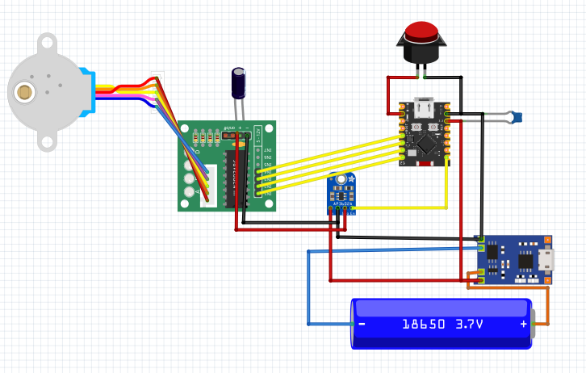
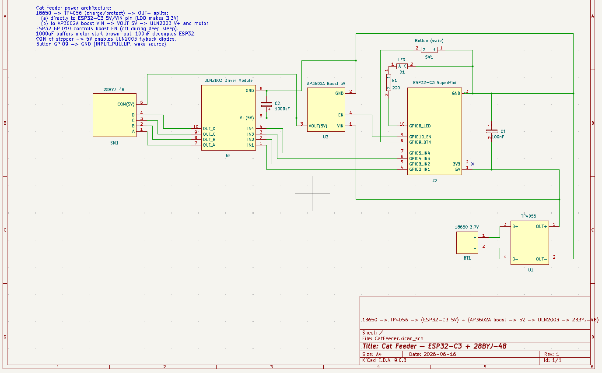

# Cat Feeder — ESP32-C3 automatic feeder

Automatic dry food dispenser. An ESP32-C3 SuperMini drives a 28BYJ-48 stepper motor
through a ULN2003 module, turning a 3D-printed auger screw that dispenses food pellets.
Feeding is triggered by a time schedule or by a physical button press.
The device runs from a single 18650 cell and sleeps between events.

---

## Hardware

| Ref | Component | Notes |
|-----|-----------|-------|
| U2 | ESP32-C3 SuperMini | MCU + BLE 5.0 |
| U1 | TP4056 module | 18650 charging + protection |
| U3 | AP3602A boost module | 5 V rail for motor |
| M1 | ULN2003 driver module | stepper driver |
| SM1 | 28BYJ-48 stepper | auger drive |
| BT1 | 18650 Li-Ion cell | main power source |
| SW1 | Momentary push button | manual feed / wake |
| D1 | LED | status indicator |
| R1 | 220 Ω | LED current limit |
| C1 | 100 nF | power decoupling |
| C2 | 1000 µF | motor current buffer |

### Wiring

See schematic in [`schema/KiCad/cat_feeder.pdf`](schema/KiCad/cat_feeder.pdf)
or open the KiCad project at [`schema/KiCad/CatFeeder.kicad_sch`](schema/KiCad/CatFeeder.kicad_sch).




**Pin map (ESP32-C3 SuperMini):**

| GPIO | Connects to | Direction |
|------|-------------|-----------|
| 2 | ULN2003 IN1 | OUT |
| 3 | ULN2003 IN2 | OUT |
| 4 | ULN2003 IN3 | OUT |
| 5 | ULN2003 IN4 | OUT |
| 8 | LED via 220 Ω to GND | OUT |
| 9 | Button to GND (INPUT\_PULLUP) | IN / wake |
| 10 | AP3602A boost EN | OUT |

Power path: `18650 → TP4056 → ESP32-C3 VIN` (always on)
and `18650 → TP4056 → AP3602A VIN → 5 V → ULN2003 + motor` (switched via GPIO 10).

---

## Software setup

### Requirements

- [VS Code](https://code.visualstudio.com/) with the
  [PlatformIO IDE](https://platformio.org/install/ide?install=vscode) extension
- USB cable (the C3 SuperMini uses native USB — port appears as `/dev/ttyACM0` on Linux)

### Build and flash

1. Open the **`CatFeeder/`** folder in VS Code (it is the PlatformIO project root).
2. Select the environment:
   - `c3` — ESP32-C3 SuperMini (production target)
   - `s3` — ESP32-S3 DevKitC-1 (breadboard test; same GPIO numbers)
3. Click **Upload** in the PlatformIO toolbar, or run:

```bash
pio run -e c3 --target upload
```

4. Open the Serial Monitor at **115200 baud**:

```bash
pio device monitor -e c3
```

> **Flash mode on C3 SuperMini:** if the board doesn't enter download mode automatically,
> hold **BOOT (GPIO 9)** while pressing **RESET**, then release RESET.

---

## First-run configuration via Serial console

All configuration is done by typing commands in the PlatformIO Serial Monitor
(line ending: `\n` or `\r\n`).

### 1. Configure Wi-Fi for automatic time sync (one-time setup)

The device has no RTC chip. On every cold boot (power-on after battery removed or
discharged) it connects to Wi-Fi, fetches UTC time from NTP, then immediately
disconnects. Wi-Fi is **never used after deep-sleep wakes** — only on cold boot.

```
WIFI_SSID MyNetwork
WIFI_PASS mypassword
```

Credentials are saved to flash and never need to be entered again.
If Wi-Fi is unavailable, the device falls back to manual time entry:

```
SET_TIME 1750420800
```

Get the current Unix epoch in your terminal:

```bash
date +%s
```

### 2. Set the feeding schedule

Times are in **UTC**. Up to 8 entries, space-separated.

```
SCHED 07:00 18:30
```

The schedule is saved to flash (NVS) and survives power-off.

Between scheduled feeds the device is in deep sleep. It wakes automatically at each
scheduled time, runs the motor, then sleeps until the next entry.

**Scheduled feed limits** (config.h):

| Limit | Default | Description |
|-------|---------|-------------|
| `MAX_PORTIONS_PER_DAY` | 4 | Max scheduled feeds per day; extras are skipped |
| `MIN_INTERVAL_SEC` | 1800 s | Min gap between scheduled feeds (30 min) |

These limits apply **only to the schedule**. Button press and `FEED` serial command
are always allowed regardless of how recently the motor ran.

### 3. Calibrate portion size

Portion size is defined in **stepper steps**, not time. Calibrate by weighing:

```
CAL 512       ← run motor 512 steps; weigh the dispensed food
CAL 768       ← try a different value
SAVE          ← commit the chosen step count to flash
```

Repeat `CAL` until the dispensed amount matches the desired portion weight.
`SAVE` must be sent explicitly — until then the new value is not persisted.

### 4. Verify

```
STATUS        ← show time, steps, portionsToday, schedule with next feed countdown
FEED          ← manual feed (no limits)
RESET_DAY     ← zero portionsToday and lastFeedEpoch (for testing)
```

---

## All Serial commands

| Command | Description |
|---------|-------------|
| `WIFI_SSID <ssid>` | Save Wi-Fi network name to flash |
| `WIFI_PASS <pass>` | Save Wi-Fi password to flash |
| `WIFI_SYNC` | Connect and sync time via NTP now |
| `SET_TIME <epoch>` | Set wall clock manually (Unix seconds UTC) |
| `SCHED HH:MM [HH:MM ...]` | Set feeding schedule (UTC, up to 8 entries) |
| `CAL <steps>` | Run motor N steps without counting as a feed |
| `SAVE` | Save the last CAL step count to flash |
| `FEED` | Dispense one portion (no limits) |
| `STATUS` | Print current device state incl. schedule and Wi-Fi SSID |
| `RESET_DAY` | Zero portionsToday and lastFeedEpoch |

---

## Button behaviour

| Press | Action |
|-------|--------|
| Short press | Dispense one portion (no limits — always allowed) |
| Long press ≥ 2 s | Enter deep sleep immediately without feeding |

---

## Power notes

- The device enters deep sleep between feeds. Wake sources: button or RTC timer.
- The 5 V motor rail (boost converter) is switched on only during a dose, then cut.
- Always-on current in deep sleep: ~50–100 µA (ESP32-C3 + LDO quiescent).
- Expected battery life on 3000 mAh 18650 with 4 feeds/day: **several months**.
